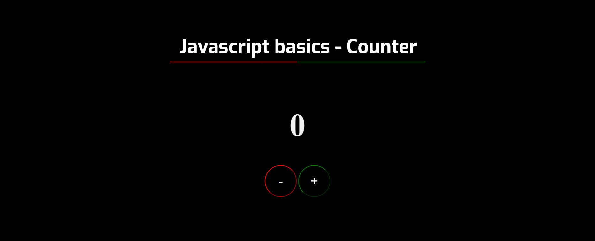

#Javascript Basics

L'applicazione permette all'utente di visualizzare un valore e di aumentarlo o diminuirlo grazie all'utilizzo di 2 pulsanti (+ e -).

##Sviluppo

Il Counter è stato sviluppato con:

  * __HTML__;
  * __CSS__;
  * __JavaScript__;

##Link

Cliccando su questo link è possibile provare l'applicazione.

<https://jsbasicscounter.netlify.app/>
